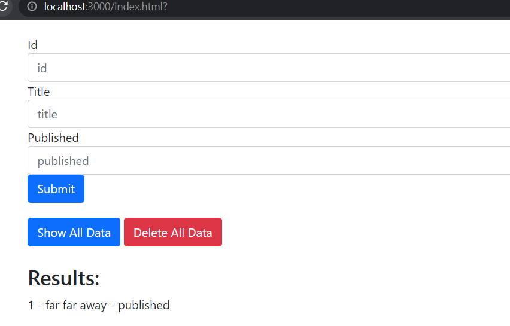

# Project
## Book tracker

# Description
### A simple 3 tier app which provides basic express project structure for beginners. Can find CRUD operation requests developed with Express framework, superagent used in the frontend code to access those API end points. A simple lowdb is used to store and retrieve the data instantly.

# How to
### Install nodejs, npm
### Clone the repo
### Do npm install
### Command to run express server - node server.js
### Then go to localhost:3000/index.html

## Contact:
### gv68682@gmail.com